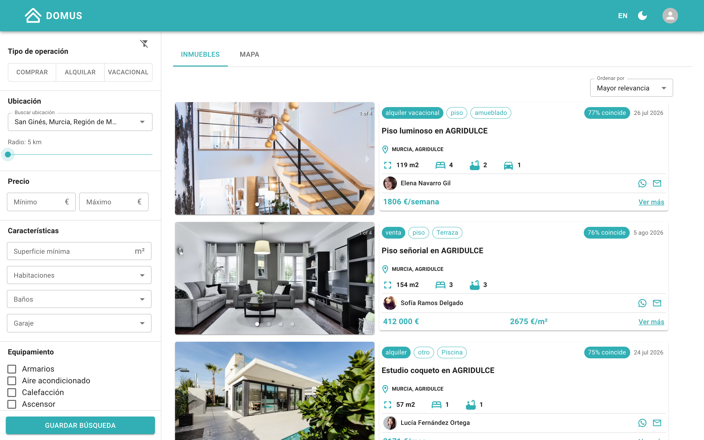
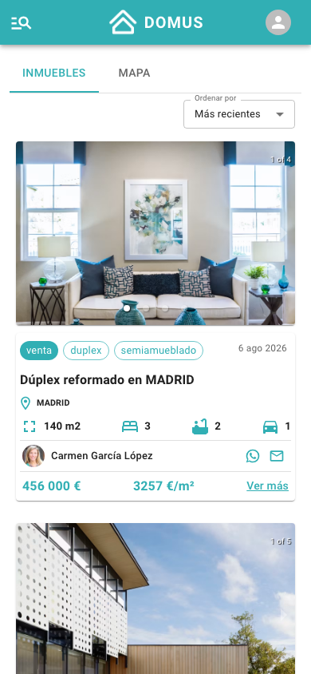

# Domus 🏠

Plataforma inmobiliaria full-stack que conecta oferta, demanda y agentes inmobiliarios de manera segura y eficiente.

**Demo en producción:** [domus-frontend-production-f950.up.railway.app](https://domus-frontend-production-f950.up.railway.app)

| Escritorio | Móvil |
|---|---|
|  |  |

## Qué hace

- **Listado público de viviendas** con fotos, precio (€/m² en venta, €/mes en alquiler) y datos del anunciante — sin necesidad de registrarse
- **Búsqueda con filtros combinables**: ubicación real de España (provincia → municipio → población → barrio vía [geoapi.es](https://geoapi.es)), precio, superficie, habitaciones, baños, garajes y 10 características de equipamiento
- **Requerimientos guardados**: un comprador guarda su búsqueda como "requerimiento" y los agentes pueden verlos para ofrecerle inmuebles
- **Publicación de inmuebles** con subida de imágenes a Cloudinary
- **Autenticación JWT** con registro, login, recuperación de contraseña por email y perfiles con avatar
- **Contacto directo** con el anunciante por WhatsApp, teléfono o email
- **Tests de integración** de la API con Jest + Supertest sobre MongoDB en memoria

## Stack

| Capa | Tecnología |
|---|---|
| Frontend | React 18 + Vite, Material UI, React Router, i18next |
| Backend | Node.js, Express, Mongoose |
| Base de datos | MongoDB |
| Imágenes | Cloudinary |
| Geografía | geoapi.es (provincias, municipios y núcleos reales del INE) |
| Emails | Brevo (recuperación de contraseña) |
| Deploy | Railway (3 servicios: frontend, backend y MongoDB) |

## Arquitectura

```
┌────────────────┐      ┌────────────────┐      ┌────────────┐
│    frontend/   │ ───► │    backend/    │ ───► │  MongoDB   │
│  React + Vite  │ REST │ Express + JWT  │      │  (Railway) │
└───────┬────────┘      └────────────────┘      └────────────┘
        │
        ├──► geoapi.es    (ubicaciones reales de España)
        └──► Cloudinary   (subida de imágenes desde el navegador)
```

## Desarrollo local

```bash
# Backend (puerto 8080)
cd backend
npm install
# crea un .env con: MONGO_URL, JWT_SECRET, FRONTEND_URL, BREVO_APIKEY
npm run nodemon

# Frontend (puerto 5173)
cd frontend
npm install
# crea un .env con: VITE_BACKEND_URL=http://localhost:8080
npm run dev
```

## Deploy

Cada carpeta está enlazada a su servicio de Railway (proyecto `domus`):

```bash
cd backend && railway up --ci    # servicio domus-backend
cd frontend && railway up --ci   # servicio domus-frontend
```

Variables de entorno en Railway: `MONGO_URL` (referencia al servicio MongoDB), `JWT_SECRET`, `FRONTEND_URL` y `BREVO_APIKEY` en el backend; `VITE_BACKEND_URL` en el frontend.

## Tests

La API tiene tests de integración con **Jest + Supertest** que corren contra una **MongoDB en memoria** (no tocan datos reales): registro y login con JWT, alta y filtrado de viviendas, y requerimientos.

```bash
cd backend
npm test
```

```text
Usuarios: registro y login
  ✓ el registro devuelve 201 y un token JWT
  ✓ no permite registrar dos veces el mismo email
  ✓ el login con credenciales correctas devuelve token y datos del usuario
  ✓ el login con password incorrecto devuelve 400
Viviendas
  ✓ sin viviendas, el listado devuelve 200 con array vacío
  ✓ crear una vivienda y recuperarla con el filtro de activas
  ✓ el filtro por status no devuelve viviendas de otro estado
Requerimientos
  ✓ sin requerimientos, el listado devuelve 200 con array vacío
  ✓ crear un requerimiento y verlo en el listado

Tests: 9 passed, 9 total
```

## Datos de demostración

`backend/scripts/seed-housing.mjs` genera 60 viviendas realistas en 12 municipios españoles (con los códigos INE exactos que usan los filtros) y 10 usuarios ficticios con avatar:

```bash
node backend/scripts/seed-housing.mjs
```

---

Desarrollado por [Claudia Vásquez](https://claudiavasquez.dev)
